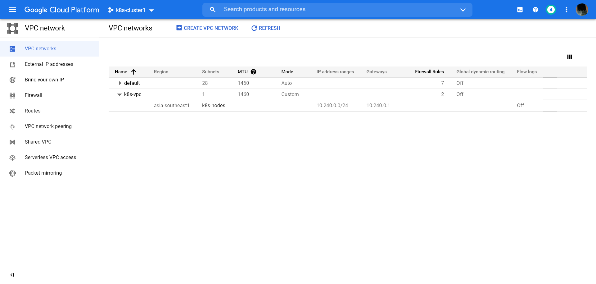

# Triển khai một cluster K8s trên Google Cloud

## 1. Chuẩn bị

- Chuẩn bị môi trường gcloud command line trên máy tính. (quá trình cài đặt và đăng nhập có thể xem tại `https://cloud.google.com/sdk/docs/install`)

- Đăng nhập tài khoản google cloud trên browser

## 2. Tạo các VM chạy ubutu trên google cloud

### 2.1. Tạo subnet (options)

> Note: Trước khi tạo các VM, ở đây mình sẽ tạo một subnet riêng để cài k8s trên đó.

Truy cập vào: `https://console.cloud.google.com/networking/networks/add?` để tạo pvc (Virtual Private Cloud) rồi tạo subnet cho mạng mong muốn. Thông số mình cài đặt như sau:

    - Tên của PVC: k8s-pvc
    - Tên subnet: k8s-nodes
    - Tên region: asia-southeast1 (`asia-southeast1	` ở Singapore nên mình nghĩ sẽ gần và ổn định nhất)
    - IP ranges: 10.240.0.0/24

Và đây là kết quả sau khi tạo:


### 2.2. Cấu hình firewalls

> Cấu hình toàn bộ PVC mở tất cả port internal, và mở một số port khi có truy cập từ bên ngoài

- Cấu hình internal (mở tất cả port khi truy cập internal pvc)

  ```console
  gcloud compute firewall-rules create allow-k8s-cluster-internal \
  --allow tcp,udp,icmp,ipip \
  --network k8s-vpc \
  --source-ranges 10.240.0.0/24
  ```

- Cấu hình external (mở một số port phục vụ tương tác với api server và các service dạng NodePort sau này)

  ```console
  gcloud compute firewall-rules create allow-k8s-cluster-external \
  --allow tcp:22,tcp:6443,tcp:30000-32000,	icmp \
  --network k8s-vpc \
  --source-ranges 0.0.0.0/0
  ```

### 2.3. Tạo 3 VM

> Ở đây mình sẽ sử dụng `gcloud` command line để tạo 3 VM. Quá trình tạo mình có gán VM vào subnet vừa tạo ở trên. Nếu bạn không tạo subnet có thể bỏ 2 tham số `--private-network-ip` và `--subnet`

- Tạo 1 VM phục vụ làm master-node k8s(tên là `controller`)

  ```console
  gcloud compute instances create controller \
      --async \
      --boot-disk-size 200GB \
      --can-ip-forward \
      --image-family ubuntu-1804-lts \
      --image-project ubuntu-os-cloud \
      --machine-type e2-medium \
      --private-network-ip 10.240.0.11 \
      --scopes compute-rw,storage-ro,service-management,service-control,logging-write,monitoring \
      --subnet k8s-nodes \
      --zone asia-southeast1-b \
      --tags example-k8s,controller
  ```

- Tạo 2 VM phục vụ làm woker-node k8s (tên lần lượt là `worker-1` và `worker-2`)

  ```console
  for i in 1 2; do
  gcloud compute instances create worker-${i} \
      --async \
      --boot-disk-size 200GB \
      --can-ip-forward \
      --image-family ubuntu-1804-lts \
      --image-project ubuntu-os-cloud \
      --machine-type e2-medium \
      --private-network-ip 10.240.0.2${i} \
      --scopes compute-rw,storage-ro,service-management,service-control,logging-write,monitoring \
      --subnet k8s-nodes \
      --zone asia-southeast1-b \
      --tags example-k8s,worker
  done
  ```

## 3. Cài đặt cụm K8s

### 3.1. Cài đặt môi trường cho tất cả workernode và masternode

- Cài đặt docker

  ```console
  sudo apt update
  sudo apt install -y docker.io
  sudo systemctl enable docker.service
  sudo apt install -y apt-transport-https curl
  ```

- Cài đặt kubelet, kubeadm ,kubectl

  ```console
  curl -s https://packages.cloud.google.com/apt/doc/apt-key.gpg | sudo apt-key add -
  cat <<EOF | sudo tee /etc/apt/sources.list.d/kubernetes.list
  deb https://apt.kubernetes.io/ kubernetes-xenial main
  EOF
  sudo apt-get update
  sudo apt-get install -y kubelet kubeadm kubectl
  sudo apt-mark hold kubelet kubeadm kubectl
  ```

- Cấu hình docker:

  - tạo file `/etc/docker/daemon.json` với nội dung như sau:

  ```console
  {
    "exec-opts": ["native.cgroupdriver=systemd"]
  }
  ```

  - Khởi chạy lại các dịch vụ liên quan:

  ```console
      systemctl daemon-reload
      systemctl restart docker
      systemctl restart kubelet
  ```

### 3.2. Cài đặt master node

- Khởi tạo cluster

  ```console
  sudo kubeadm init --pod-network-cidr 192.168.0.0/16
  ```

  Khởi tạo thành công ở cuối output sẽ có dòng định dạng như sau:

  ```console
  kubeadm join 10.240.0.11:6443 --token <token>         --discovery-token-ca-cert-hash sha256:<cert-hash>
  ```

  Lưu câu lệnh đó lại để bước sau triển khai trên các worker node.

- Cấu hình `kubectl` nhận config cluster:

  ```console
  mkdir -p $HOME/.kube
  sudo cp -i /etc/kubernetes/admin.conf $HOME/.kube/config
  sudo chown $(id -u):$(id -g) $HOME/.kube/config

  ```

### 3.3. Cài đặt worker node

- Copy output câu lệnh đã lưu ý ở trên (có định dạng `kubeadm join 10.240.0.11:6443 ....`) và chạy ở các worker node.

### 3.4. Cài đặt Calico

- Tất cả các câu lệnh `kubeadm init` và `kubeadm join` đều thành công nghĩa là bạn đã hoàn thành việc khởi tạo cluster.

- Cài đặt Calico

  ```console
  curl https://docs.projectcalico.org/manifests/calico.yaml -O
  kubectl apply -f calico.yaml
  ```

## 4. Tài liệu
- [Hướng dẫn triển khai k8s cluster trên google cloud của Calico](https://docs.projectcalico.org/getting-started/kubernetes/self-managed-public-cloud/gce)

- [Khắc phục lỗi kubelet không thể start](https://stackoverflow.com/questions/52119985/kubeadm-init-shows-kubelet-isnt-running-or-healthy)
